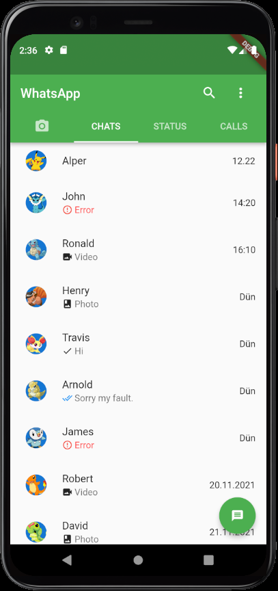
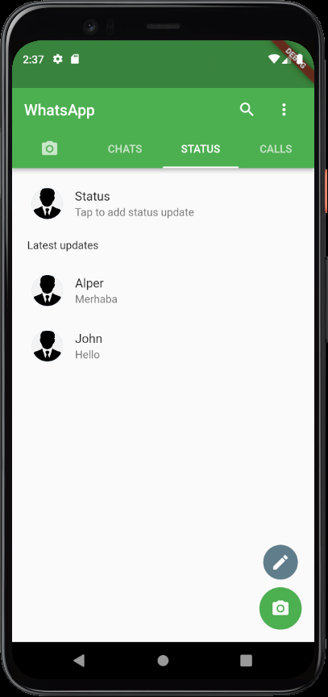
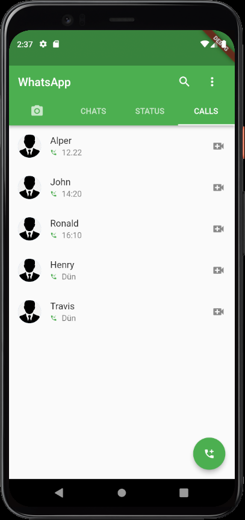
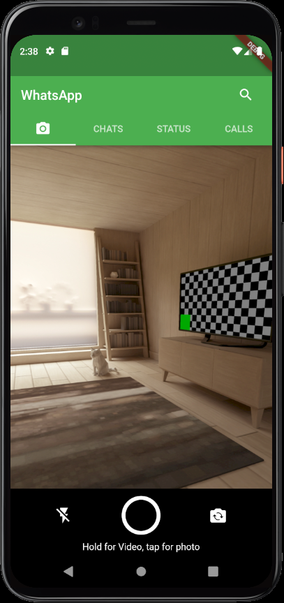

# whatsapp_clone

WhatsApp clone by Acapnes.

## Getting Started

This project was developed with Flutter.

## Screens
###1- Chats Screen

###2- Status Screen

###3- Status Screen

###4- Status Screen

